# Phase 9 execution map

## Dependency graph

```mermaid
flowchart LR
  P90[9.0 Baseline] --> P91[9.1 RBAC]
  P91 --> P92[9.2 Customer]
  P92 --> P93[9.3 Contractor]
  P93 --> P94[9.4 ProjectUpdate]
  P94 --> P95[9.5 Operations UI]
  P95 --> P96[9.6 Today/Nav/Config]
  P96 --> P97[9.7 Dashboard Core/Project]
  P97 --> P98[9.8 Customer/System Dash]
  P98 --> P99[9.9 Contractor Dash]
  P99 --> P910[9.10 Stabilization]
```

## Commit map

| Step | Suggested commit |
|---|---|
| 9.0 | `docs(phase9): lock scope decisions and baseline` |
| 9.1 | `feat(rbac): add Phase 9 permissions and custom-role access` |
| 9.2 | `feat(projects): group projects by customer` |
| 9.3 | `feat(contractors): add project contractor assignments` |
| 9.4 | `feat(project-updates): add continuous project update timeline` |
| 9.5 | `feat(project-operations): add project and contractor management UI` |
| 9.6 | `feat(reports): add today navigation and configuration integration` |
| 9.7 | `feat(dashboard): add section-status project dashboard` |
| 9.8 | `feat(dashboard): add customer and system scopes` |
| 9.9 | `feat(dashboard): add contractor scope` |
| 9.10 | `chore(release): stabilize and document Phase 9` |

## Gate rule

Không chạy prompt tiếp theo khi:

- targeted tests fail;
- full suite fail không rõ nguyên nhân;
- DB current != head;
- git diff chứa thay đổi ngoài scope;
- security audit fail;
- commit chưa được review.
