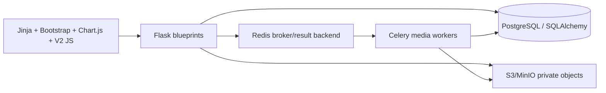

# Current system architecture

**VERIFIED** from `app/__init__.py::create_app/register_blueprints`, `app/celery_app.py`, `app/storage/`, and `app/media_processing/`.

Blueprints: auth/account, modules/navigation, dashboard/API, projects, reports and `daily_report_create_v2`, issues, attachments, admin, and independent partner/document/media modules. `create_app` installs global login and Reports-module guards; all non-public endpoints require login. Background jobs are staged on V2 finalize then dispatched after DB commit (`app/reports/services.py::finalize_daily_report_create_v2`).

**INFERRED.** Phase 9 should remain a Reports-domain extension: reuse its services and tables without coupling Partner module models.
