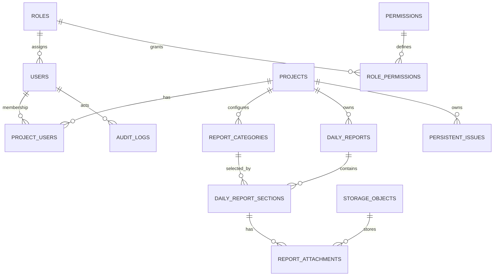

# Current data model

**VERIFIED** model evidence: `app/models/project.py`, `daily_report.py`, `issue.py`, `rbac.py`, `storage.py`, `media_processing.py`, `audit_log.py`.

`Project` soft-deletes; `ProjectUser` is unique `(project_id,user_id)`, active/inactive, stores a display preset and canonical boolean capabilities. `ReportCategory` is soft-deletable and unique `(project_id,name)` at DB level. `DailyReport` uniquely reserves `(project_id,report_date)` and `(project_id,client_request_id)`; `DailyReportSection` uniquely binds one category per report. `PersistentIssue` only links project/owner/creator. `ReportAttachment` references private `StorageObject`; `AuditLog` stores JSON old/new snapshots.

Compatibility fields: `User.role` is legacy mirror while `role_id` is canonical; `ProjectUser.role_in_project` aliases `project_role_code`; nullable `DailyReport.client_request_id` is pre-V2 compatibility; nullable attachment storage FK is migration-transition compatibility. Category name/icon are read through the current category relationship—there is no snapshot field on section (**VERIFIED**).
