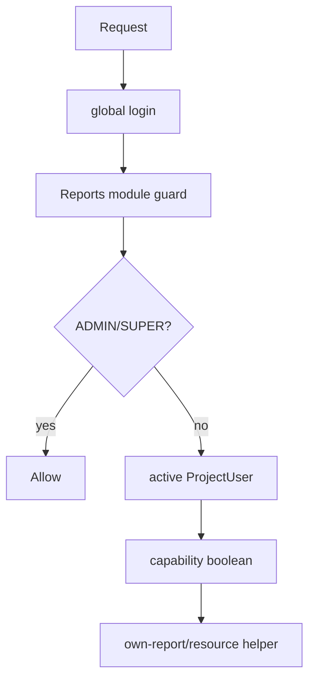

# RBAC and project scope

**VERIFIED** from `app/project_memberships.py`, `app/auth/permissions.py`, `app/permissions/registry.py`, `app/permissions/services.py`, and [DB grants](evidence/permission_database_summary.txt).

| Role | Global scope | Reports effective rights |
|---|---|---|
| SUPER_ADMIN | bypasses `user.can`; project admin | all project capabilities |
| ADMIN | project admin | all project capabilities |
| VIEWER_ADMIN | global read | read capability subset only |
| PROJECT_MANAGER | **legacy DB role**, no intrinsic project bypass | depends on active membership flags |
| REPORTER | **legacy DB role**, no intrinsic project bypass | depends on active membership flags |

`project_role_code`/`role_in_project` is metadata/preset, not authorization; booleans are source of truth. Reporter-style preset can view/create/edit own reports and view issues; edit all, archive, categories, issue mutation are separately granted. `can_edit_report` explicitly permits creator + `can_edit_own_reports`, or `can_edit_all_reports`; delete requires `can_archive_reports`. No assignment produces empty project/report lists but direct project/report/dashboard routes normally return 403 (dashboard requires read; lists use `IN([0])`).

DB grants differ from registry defaults: system registry defines only SUPER_ADMIN/ADMIN/VIEWER_ADMIN, while DB has legacy/custom roles. UI nav uses `user.can`, but route project capabilities govern Reports resources; this is a deliberate three-layer pattern and a Phase 9 test target.
