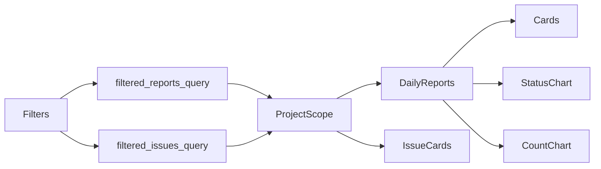

# Dashboard and aggregations

**VERIFIED.** `/reports/dashboard` is `dashboard.routes::index`; project page is `/projects/<id>/dashboard`; chart APIs are `/api/reports/dashboard/status-chart` and `report-count-chart`. `dashboard.services::filtered_reports_query` aggregates `DailyReport.overall_status` only: pie status and bar count both count reports, never sections. Issues use `PersistentIssue` separately; cards show report status counts, issue totals/open/critical, latest reports, and issue lists.

Project scope uses `accessible_project_ids(current_user, can_view_project)`; ADMIN/SUPER get all, VIEWER_ADMIN global read, memberships restrict. `accessible_reporters` performs an extra projects query and returns memberships; dashboard context executes multiple count/list queries but no per-row loop is evident in service source. Missing reports are not represented: no expected-calendar/project denominator query exists. Filters are project/from/to/status/reporter. Current service is reusable for safe base scope only; SYSTEM/CUSTOMER/CONTRACTOR needs core queries/model joins, not cosmetic filters.
