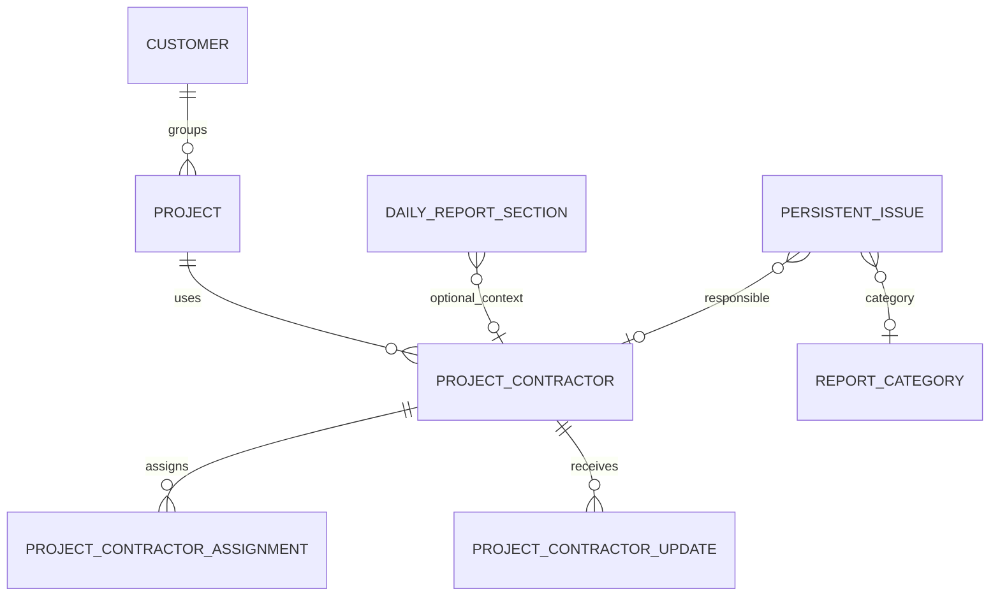

# TARGET: Phase 9 architecture recommendation

**TARGET, not current state.** Current evidence: project-scoped categories/reports/issues and separate Partner domain. Gap: Customer/contractor aggregation and responsibility.

Recommend a new Customer domain; additive nullable `projects.customer_id`; new project-local contractor entities (not `Partner`); keep `ReportCategory`; extend section/issue only with nullable context links after policy decisions. Implement dashboard query services around an explicit `DashboardScope` value object (SYSTEM/CUSTOMER/PROJECT/CONTRACTOR), not an ORM table unless saved views are required. Route ownership remains Reports blueprint/sub-blueprints; use service boundaries for customer, contractors, today, dashboard aggregation.

Migration: nullable columns/new tables first; no destructive link. RBAC: explicit contractor/dashboard capabilities. Tests: scope isolation, old report rendering, V2 finalize. Compatibility: preserve all existing URLs and optional/null associations.
