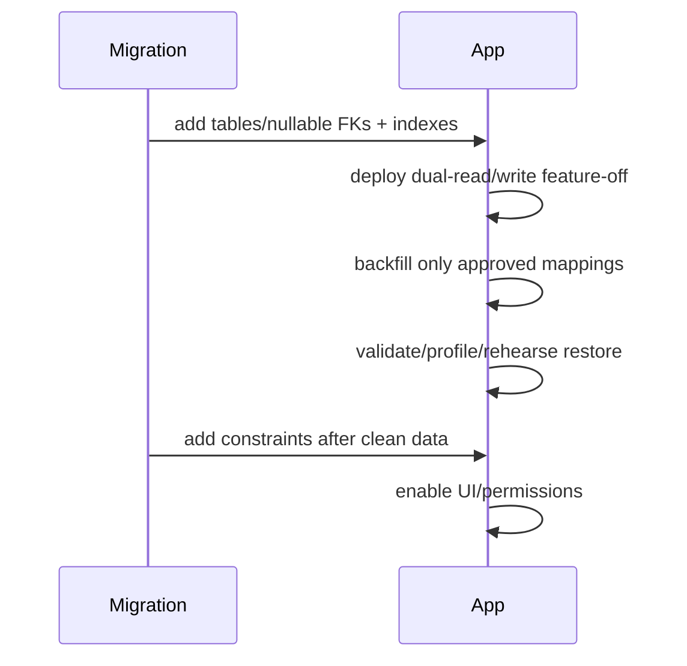

# TARGET: migration and compatibility plan

Current evidence: head `20260725_0026`, legacy nullable V2 fields and hard-delete reports. Gap: no Customer/contractor links. Recommendation: additive-only rollout.

Order: create Customer and contractor tables; add nullable project/customer and issue/section links; deploy reads accepting null; backfill only owner-approved mapping; validate FK/duplicates; add indexes and later non-null/unique constraints where product rules demand. Archive rather than hard-delete Customer/contractor references. Rollback is application feature toggle + retain nullable columns; never downgrade data destructively. Rehearse on PostgreSQL copy, backup/restore, migration timing and V2 finalize concurrent with migration. Test migration upgrade, existing reports/categories, attachment authorization, and report historical render.
