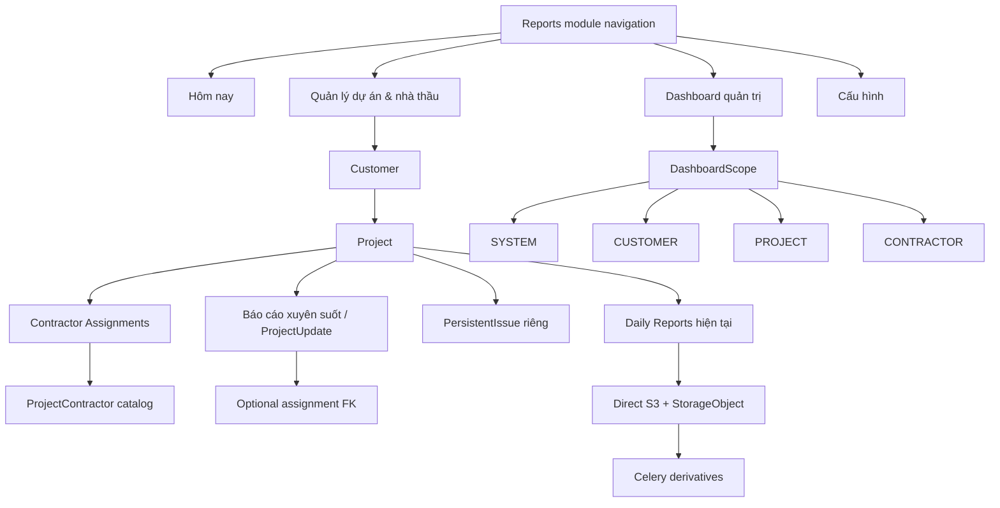
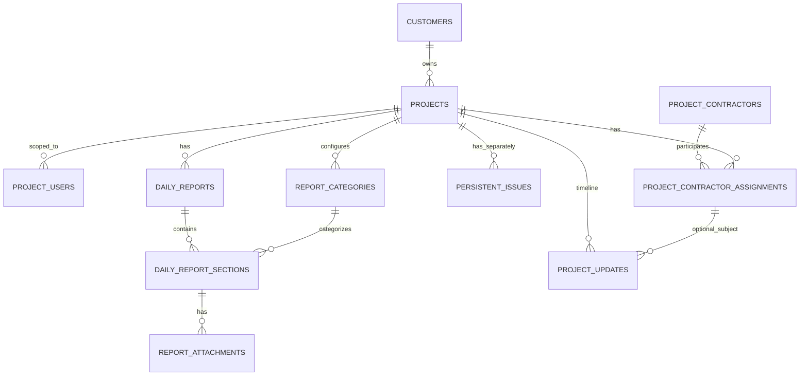

# Kiến trúc đích Phase 9

## Component map



## Model map



## Suggested packages

Tên file cuối cùng phải theo convention source thật sau khi Codex audit. Gợi ý:

```text
app/models/customer.py
app/models/project_contractor.py
app/models/project_update.py
app/project_operations/
app/templates/project_operations/
```

Không tạo một model/project route song song với `Project` hoặc `ReportCategory` hiện tại.

## Route target

```text
GET  /reports/today
GET  /project-operations
GET  /project-operations/customers/<id>
GET  /project-operations/projects/<id>
GET  /project-operations/projects/<id>/contractors/<role>
GET  /project-operations/projects/<id>/updates
POST /project-operations/projects/<id>/updates
GET  /project-operations/contractors/<id>

GET  /reports/dashboard/system
GET  /reports/dashboard/customers/<id>
GET  /projects/<id>/dashboard
GET  /reports/dashboard/contractors/<id>
GET  /reports/config
```

Có thể dùng API JSON riêng cho chart. Route cũ phải giữ hoặc redirect có kiểm thử.

## Workspace project

```text
Tổng quan
Báo cáo ngày
Báo cáo xuyên suốt
Vấn đề tồn đọng
Đối tác thi công
Đối tác giải pháp
```

## Data lifecycle

- Customer: active → archived.
- ProjectContractor: active → archived.
- Assignment: active/paused/completed/ended.
- ProjectUpdate: active → soft deleted.
- Daily Report/PersistentIssue: giữ lifecycle hiện tại, không coupling mới.
